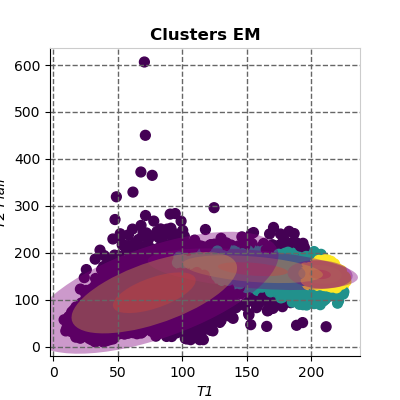

# Expectation Maximization EM for Brain MRI Images #

The Expectation-Maximization (EM) algorithms are iterative methods that find the maximum likelihood estimated parameters over a statistical model. Each algorithm iteration is performed in two steps - The Expectation step (E-step) which measures the log-likelihood expectation on some already estimated parameter. Then a Maximization step (M-step) maximizes the expected log-likelihood calculated in the E-step.

# Results #

EM Segmentation Result     |  EM Data distribution  
:-------------------------:|:-------------------------:
 |  

# Metrics #

| Patient        | CSF-Kmeans         |    GM-Kmeans    |    WM-Kmeans    |    CSF-EM    |    GM-EM     |    WM-EM     | Time   (s)  | Iterations |
|----------------|--------------------|-----------------|-----------------|--------------|--------------|--------------|-------------|------------|
| Case 1         |       81.56%       | 69.63%          | 82.30%          |    85.04%    |    82.22%    |    90.67%    |    19.71    |    44      |
|    Case   2    |       74.64%       | 84.79%          | 69.48%          |    68.79%    |    83.74%    |    15.83%    |    28.73    |    59      |
|    Case   3    |       71.35%       | 83.80%          | 81.42%          |    77.95%    |    83.73%    |    85.56%    |    18.83    |    41      |
|    Case   4    |       77.80%       | 82.13%          | 68.83%          |    86.90%    |    90.08%    |    84.00%    |    17.67    |    40      |
|    Case   5    |       83.68%       | 79.17%          | 85.43%          |    88.99%    |    84.64%    |    86.57%    |    22.58    |    47      |
